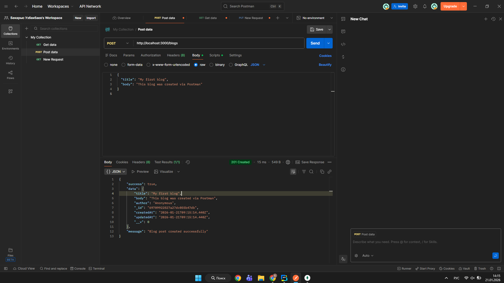
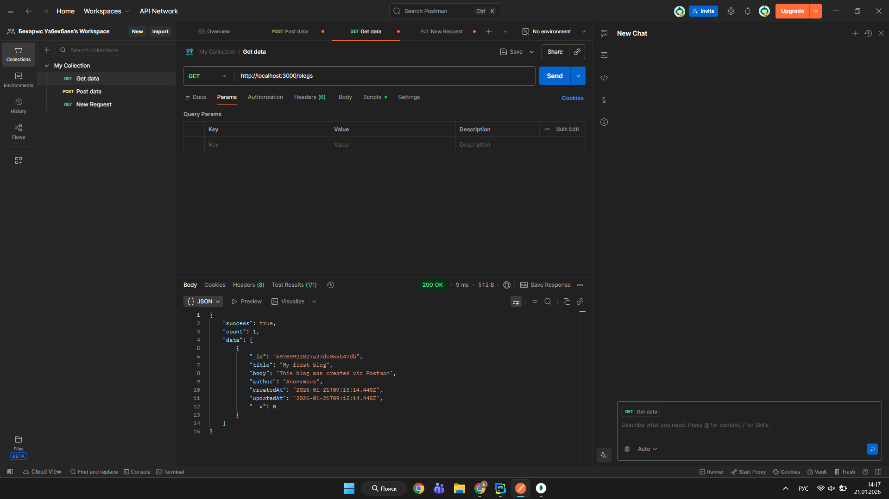
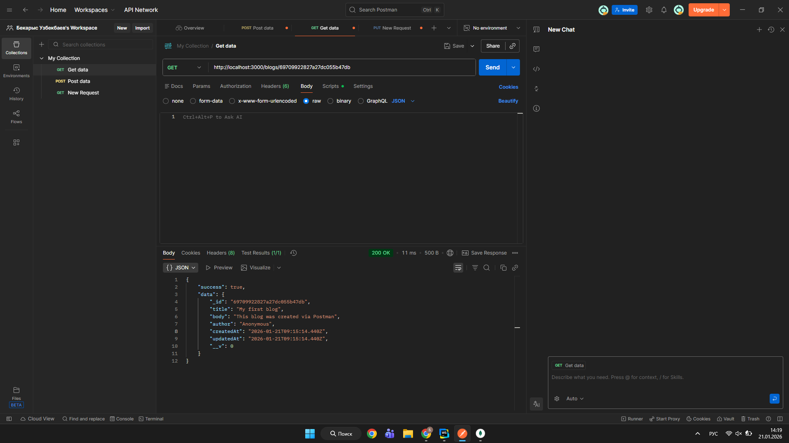
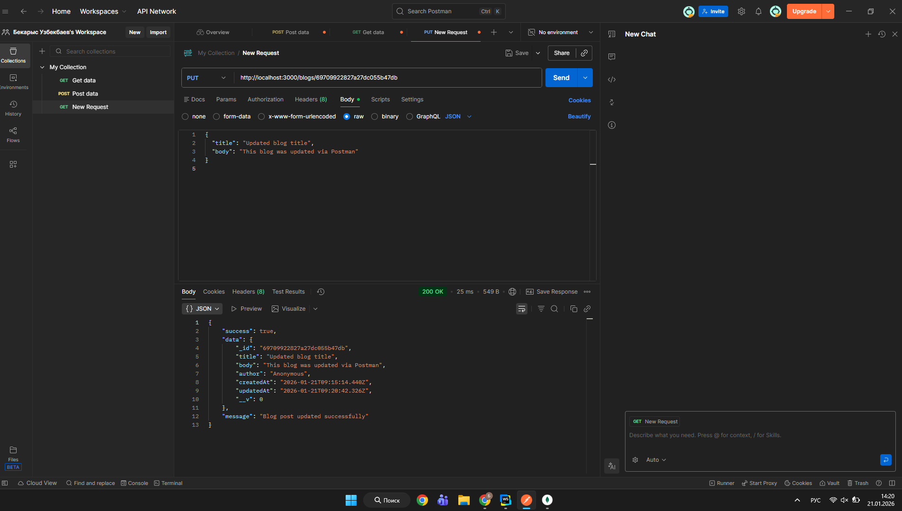
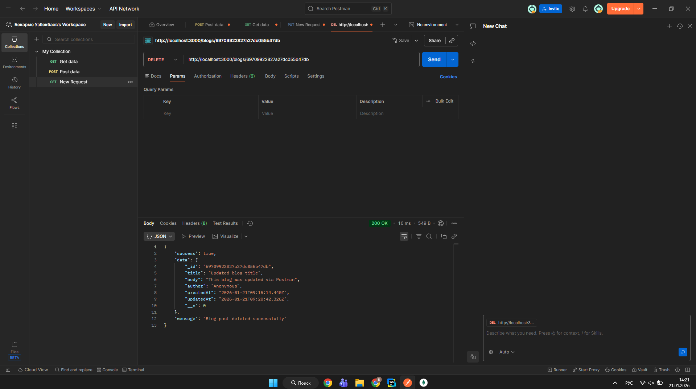

# Blog Platform - CRUD API with Node.js and MongoDB

A fully functional CRUD (Create, Read, Update, Delete) API for a simple blogging platform built with Node.js, Express, and MongoDB.

## Features

- ✅ **RESTful API Endpoints**: Complete CRUD operations for blog posts
- ✅ **MongoDB Integration**: Uses Mongoose for database operations
- ✅ **Data Validation**: Ensures required fields (title, body) are present
- ✅ **Error Handling**: Comprehensive error handling with appropriate HTTP status codes
- ✅ **Frontend Interface**: Beautiful, responsive web interface to interact with the API
- ✅ **Timestamps**: Automatic createdAt and updatedAt timestamps

## Project Structure

```
assignment3/
├── index.js              # Main server file with API endpoints
├── package.json          # Project dependencies and scripts
├── .env.example          # Environment variables template
├── README.md             # Project documentation
└── public/               # Frontend files
    ├── index.html        # Main HTML file
    ├── styles.css        # CSS styling
    └── app.js            # Frontend JavaScript
```

## Prerequisites

- Node.js (v14 or higher)
- MongoDB (local installation or MongoDB Atlas account)
- npm (Node Package Manager)

## Installation

1. **Clone or download the project**

2. **Install dependencies**
   ```bash
   npm install
   ```

3. **Set up MongoDB**
   
   **Option A: Local MongoDB**
   - Install MongoDB locally
   - Make sure MongoDB service is running
   - Default connection: `mongodb://localhost:27017/blogdb`

   **Option B: MongoDB Atlas (Cloud)**
   - Create a free account at [MongoDB Atlas](https://www.mongodb.com/cloud/atlas)
   - Create a cluster and get your connection string
   - Update the `MONGODB_URI` in `.env` file

4. **Configure environment variables**
   ```bash
   # Copy the example file
   cp .env.example .env
   
   # Edit .env and update MONGODB_URI if needed
   ```

## Running the Application

1. **Start the server**
   ```bash
   npm start
   ```

2. **Access the application**
   - Frontend: Open `http://localhost:3000` in your browser
   - API Base URL: `http://localhost:3000`

## API Endpoints

### Create a Blog Post
- **POST** `/blogs`
- **Body** (JSON):
  ```json
  {
    "title": "Blog Post Title",
    "body": "Blog post content...",
    "author": "Author Name" // Optional, defaults to "Anonymous"
  }
  ```
- **Response**: Created blog post object

### Get All Blog Posts
- **GET** `/blogs`
- **Response**: Array of all blog posts

### Get Single Blog Post
- **GET** `/blogs/:id`
- **Response**: Single blog post object

### Update a Blog Post
- **PUT** `/blogs/:id`
- **Body** (JSON):
  ```json
  {
    "title": "Updated Title", // Optional
    "body": "Updated content...", // Optional
    "author": "Updated Author" // Optional
  }
  ```
- **Response**: Updated blog post object

### Delete a Blog Post
- **DELETE** `/blogs/:id`
- **Response**: Deleted blog post object

## Testing with Postman

1. **Create a Blog Post**
   - Method: POST
   - URL: `http://localhost:3000/blogs`
   - Headers: `Content-Type: application/json`
   - Body (raw JSON):
     ```json
     {
       "title": "My First Blog Post",
       "body": "This is the content of my blog post.",
       "author": "John Doe"
     }
     ```
     

2. **Get All Blog Posts**
   - Method: GET
   - URL: `http://localhost:3000/blogs`
     


3. **Get Single Blog Post**
   - Method: GET
   - URL: `http://localhost:3000/blogs/{post_id}`
     

4. **Update a Blog Post**
   - Method: PUT
   - URL: `http://localhost:3000/blogs/{post_id}`
   - Headers: `Content-Type: application/json`
   - Body (raw JSON):
     ```json
     {
       "title": "Updated Title",
       "body": "Updated content"
     }
     ```
     
     


5. **Delete a Blog Post**
   - Method: DELETE
   - URL: `http://localhost:3000/blogs/{post_id}`
   - 

## Blog Post Schema

```javascript
{
  title: String (required),
  body: String (required),
  author: String (optional, default: "Anonymous"),
  createdAt: Date (automatic),
  updatedAt: Date (automatic)
}
```

## Error Handling

The API returns appropriate HTTP status codes:
- `200` - Success
- `201` - Created
- `400` - Bad Request (validation errors)
- `404` - Not Found
- `500` - Server Error

Error responses follow this format:
```json
{
  "success": false,
  "message": "Error message",
  "error": "Detailed error information"
}
```

## Technologies Used

- **Node.js** - Runtime environment
- **Express.js** - Web framework
- **MongoDB** - Database
- **Mongoose** - MongoDB object modeling
- **dotenv** - Environment variable management
- **CORS** - Cross-origin resource sharing


## Author
Bekarys Uzbekbayev SE-2438

